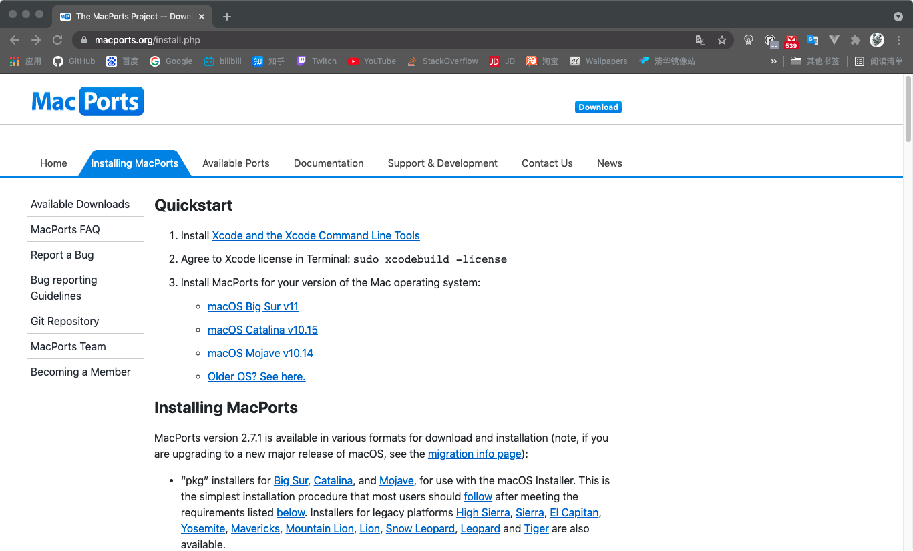

# MAC OS 包管理安装

对于开发人员来说包管理工具是一种十分强大的命令行工具，强大的如同开发人员的手足，如常见的 Linux 下的`apt-get`,`yum`,`rpm`,node 下的`npm`等等.

<u> 目前 MAC 主流的包管理工具: </u>

- [MacPorts](#macports)

- [Homebrew](#homebrew)

## MacPorts

### 介绍

- MacPorts 项目是一个开源社区计划，旨在设计一个易于使用的系统，用于在 Mac 操作系统上编译、安装和升级基于命令行、X11 或 Aqua 的开源软件。在 BSD 下提供了命令行工具。

### 官方网址

- [port 官网](https://www.macports.org/)
- [port 快速安装](https://www.macports.org/install.php)

### 安装

1. 需要安装苹果命令行开发工具，如已安装则可直接跳至**步骤 2**

   ```
   xcode-select --install
   ```

2. 在官网 installing 中根据系统版本下载相应的`.pkg`文件
   

3. 根据提示逐步安装即可
   

4. 在终端测试
   - 例：
     用`port`搜索`wget`包
     

### 使用

- 搜索软件包

  ```
    port search xxx
  ```

- 安装软件包

  ```
    port install xxx
  ```

- 查看已经安装的软件包

  ```
    port search xxx
  ```

- 卸载软件包

  ```
    port installed
  ```

- 查看软件包的信息

  ```
    port remove xxx
  ```

- 也可以直接使用`help`查看详细教程

## Homebrew

### 介绍

- Homebrew 是安装 Apple 未包含在 macOS 中的 UNIX 工具的**最简单、最灵活**的方法。它还可以将未为您的 Linux 发行版打包的软件安装到您的主目录，而无需 `sudo`。

### 官方网址

- [Homebrew 官网](https://brew.sh/)
- [文档](https://docs.brew.sh/Manpage)

### 安装

1. 按照官网提示使用`curl`运行 shell 脚本
   ```
   /bin/bash -c "$(curl -fsSL https://raw.githubusercontent.com/Homebrew/install/HEAD/install.sh)"
   ```
   此时会发现提示</br>
   ```
   curl: (7) Failed to connect to raw.githubusercontent.com port 443: Connection refused
   ```
   一查发现域名解析被`不可名状`的原因被污染了.
   
   但是 sh 文件通过浏览器依旧能够打开，所以可以通过创建本地文件来运行次脚本文件
   
   ```
    sudo chmod 777 brewinstall.sh
    sudo ./brewinstall.sh
   ```

### 国内源安装

这里推荐[国内源](https://gitee.com/cunkai/HomebrewCN)安装

- 苹果电脑标准安装脚本：（推荐 优点全面 缺点慢一点）

  ```
  /bin/zsh -c "$(curl -fsSL https://gitee.com/cunkai/HomebrewCN/raw/master/Homebrew.sh)"

  ```

- 苹果电脑极速安装脚本：（优点安装速度快 缺点 update 功能需要命令修复 ）

  ```
  /bin/zsh -c "$(curl -fsSL https://gitee.com/cunkai/HomebrewCN/raw/master/Homebrew.sh)" speed

  ```

- Linux 标准安装脚本：

  ```
  rm Homebrew.sh ; wget https://gitee.com/cunkai/HomebrewCN/raw/master/Homebrew.sh ; bash Homebrew.sh

  ```

- 苹果电脑卸载脚本：

  ```
  /bin/zsh -c "$(curl -fsSL https://gitee.com/cunkai/HomebrewCN/raw/master/HomebrewUninstall.sh)"

  ```

- Linux 卸载脚本：

  ```
  rm HomebrewUninstall.sh ; wget https://gitee.com/cunkai/HomebrewCN/raw/master/HomebrewUninstall.sh ; bash HomebrewUninstall.sh

  ```

  
  

### 使用

知道软件包具体名称，直接 `brew install 软件包名`
只知道一小部分名称，用 `brew search 小部分名称` 查询即可
例如`brew search chrome`就会把带 chrome 的软件包全部列出

**--Homebrew 中的扩展 cask 如何使用**

假设安装 firefox 运行：

`brew install --cask firefox`

cask 的图形化软件一般国内没有任何缓冲，下载很慢
