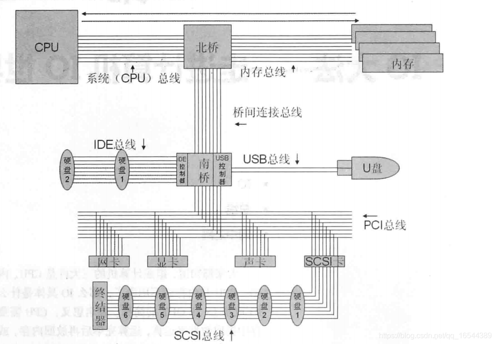
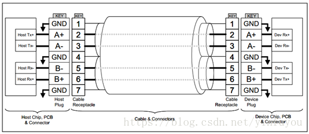
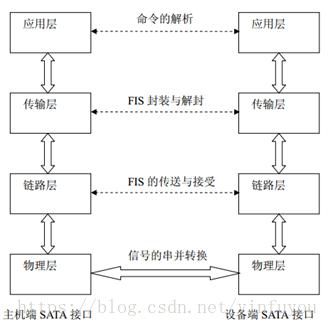

# 分布式存储学习笔记

## 目录

- [分布式存储学习笔记](#分布式存储学习笔记)
  - [目录](#目录)
  - [传统物理存储形式](#传统物理存储形式)
    - [DAS](#das)
    - [SAN](#san)
    - [NAS](#nas)
    - [磁盘冗余](#磁盘冗余)
  - [SDS软件定义存储](#sds软件定义存储)
    - [块存储](#块存储)
    - [对象存储](#对象存储)
    - [文件存储](#文件存储)
  - [分布式存储架构](#分布式存储架构)
    - [Ceph](#ceph)
    - [FusionStorage/OceanStor100D](#fusionstorageoceanstor100d)
  - [Ceph存储架构](#ceph存储架构)
    - [多副本与EC](#多副本与ec)
  - [Ceph后端存储](#ceph后端存储)
  - [Ceph部署](#ceph部署)
  - [Ceph与OpenStack集成](#ceph与openstack集成)
  
## 传统物理存储形式

    随着互联网技术的不断进步，主机，磁盘以及网络等也在不断的往前发展，数据的存储方式也在不断的变化，

- 传统物理存储形式主要包括：
  - 内部（直连）存储：

    ```
    顾名思义就是与服务器内部直接相连的磁盘或者是磁盘阵列。可以走的是SATA、SAS等接口或者是NVME等PCIe总线协议。
    ```

  - 外挂存储：
    - `DAS`(Direct-Attached Storage，简称DAS)(其中的外直连存储)
    - `FAS`(Fabric-Attached Storage，简称FAS)
    - <u>二者区别：</u></br>
        DAS可以走服务器内部的总线然后挂载到服务器上，而FAS是走网络通过不同的网络存储协议进行通信。
    - <u>二者比较优劣：</u>
      - DAS优势：中小型企业使用，简单便宜。（详见下文DAS优势）
      - FAS优势：相比较DAS不会过早出现IO瓶颈。
    - FAS：
      - `SAN`(Network-Attached Storage，简称NAS)
      - `NAS`(Network-Attached Storage，简称NAS)

### DAS

    直连式存储顾名思义就是通过电缆（通常是SCSI接口电缆）直接挂到服务器总线上，存储设备只与一台独立的主机连接，其他主机不能使用这个存储设备。
    * 很多博客会将DAS直连和内外直连存储的界限划定的非常模糊。因为都会走服务器对系统总线，占用系统的资源，而我认为分开去界定是十分有必要。
    * 维基百科中是这样定义的：“直连式存储又可分为内直连式存储和外直连式存储。内直连式存储是指存储设备与服务器通过串行或并行SCSI总线接1：3电缆直接集成在一起，但SCSI总线自身有传输距离和挂载设备的限制。外直连式存储通过SCSI或光纤通道将服务器和外部的存储设备直接连接，与内直连式存储相比，外直连式存储可通过光纤通道克服传输距离和挂载设备的限制。对于少量PC机或服务器，使用直连式存储连接简单、易于配置和管理、费用较低，但这种连接方式下，因每台计算机单独拥有自己的存储磁盘，所以不利于存储容量的充分利用和服务器间的数据共享，而且存储系统没有集中统一的管理方案，也不利于数据维护，因此直连式存储不适合作为企业级的存储解决方案。”
    * 拿最简单的个人存储的例子来说，一般来说个人pc都会把系统安装于内置的直连存储上，如果内直连存储因为主板的接口限制而达到上限无法再进行扩容时就会考虑到使用DAS的外直连存储通过SCSI接口或者光纤通道直连pc，更有甚者也可以依靠usb接口来实现存储的扩展。

- 接口和协议：
  - 协议：
    - SCSI协议：
      - SCSI接口
      - SAS接口
    - ATA协议：
      - SATA接口
      - IDE接口(目前已淘汰)
    - FC协议：
      - FC光纤接口
  - 接口：SCSI、SAS、SATA、M.2、PCIe、USB等等
  - SCSI：
  
        (Small Computer System Interface ) 小型计算机系统接口，它分为并行SCSI（内部DAS）和串行ISCSI（外部DAS）使用SCSI是需要安装SCSI适配器通过ASPI的标准软件接口驱动SCSI；单个SCSI适配器的总线可以有8到16个SCSI设备SCSI设备连接。

  - 由图可以看出SCSI通过系统PCI总线进行数据流量的传输。
  - SCSI协议

        在网络通信中每个层有每个层存在的协议，当协议发送时发送端进行封装，而接送时只有符合条件的才可以执行解封装获得数据。SCSI协议也是一种负责由SCSI设备之间通信相互达成契合的一个约定
        SCSI-3协议架构是由ANSI认可和发布的X.3.270-1996号标准，由三层组成，物理层、传输层、命令层

    - 物理层

      以网络总的物理层相似，通过物理媒介进行连接，约定采用标准范围类的接口，SCSI-3接口，IEEE串行接口，光纤通道。

    - 传输层

      定义了设备间互连和信息共享的标准规则，保障计算机生成的SCSI指令都能够成功的传送到目标端。

    - 命令层

      也称为应用层。它包括了适用于所有设备的通用指令和某一指定类型的设备专用的初级指令。

    - 此处关于SCSI协议更详细内容请参考`原文链接`：https://blog.csdn.net/qq_16544389/article/details/113788480
  - SAS接口(Serial Attached SCSI)

        采用和SATA一样的串行技术，物理接口和SATA非常相似，甚至可以向下兼容SATA标准
        * SAS接口可以向下兼容SATA，但是SATA接口显而易见无法向上兼容SAS硬盘。也就是说SAS的磁盘只能用于SAS接口，而不能用于SATA接口，而SATA的盘可以用于SAS上。
    - 优势
      1. 更好的性能：点到点的技术减少了地址冲突以及菊花链连结的减速；为每个设备提供了专用的信号通路来保证最大的带宽；全双工方式下的数据操作保证最有效的数据吞吐量；
      2. 简便的线缆连结：更细的电缆搭配更小的连接器；
      3. 更好的扩展性：可以同时连结更多的磁盘设备。
  - SATA接口

        SATA硬盘，即SATA（Serial ATA）又被称为串口硬盘。SATA采用差分信号系统，该系统能有效将噪声滤除。支持热插拔。总线使用了嵌入式时钟频率信号，具备了比以往更强的纠错能力，能对传输指令（不仅是数据）进行检查，如果发现错误会自动矫正，提高了数据传输的可靠性。

    - SATA带宽和传输速度
        |SATA版本|带宽|速度|
        |:-----:|:--:|:--:|
        |SATA 1.0|1.5GB/s|150MB/s|
        |SATA 2.0|3GB/s|300MB/s|
        |* SATA 3.0|6GB/s|600MB/s|

    - SATA接口结构

      SATA接口使用4根电缆传输数据。Tx+、Tx-表示输出差分数据线，对应的，Rx+、Rx-表示输入差分数据线。

      
    - SATA协议模型

      SATA接口协议借鉴TCP/IP模型，将SATA接口划分为四个层次来实现，包括物理层、链路层、传输层、应用层。
      
      

      - 物理层

        采用全双工串行传输方式，主要功能是进行信号的串并及并串转化。物理层接收来自链路层的数据信息，将接收到的并行的数字逻辑信号转换为串行的差分物理信号，发送到主机端。相应的物理层能将来自主机端的串行差分物理信号转化为并行的逻辑信号传送到链路层。为了提高 SATA 接口的扩展能力和响应能力， SATA 协议还引进了带外信号(Out Of Band，OOB)来协助物理层进行上电初始化以及复位操作。

      - 链路层

        分析链路层的主要功能是通过控制原语的传递来控制信息帧的整个传输过程，保证帧信息能够正确的发送与接收并能进行流量的控制，防止数据发送过快或接受过多。

        接收来自物理层的信息，对信息帧进行编码、解码、校验和扰码，然后给传输层发送 SOF 原语，通知传输层接收数据，当数据发送完成后，给传输层发送EOF原语，通知传输层该帧传输完成。

        接收来自传输层的信息，给接收的信息头封装上SOF原语和EOF原语，然后对信息帧进行编码、解码、校验、扰码，传送给物理层。

        链路层的控制原语是用来控制和维持串行链路数据传输状态。它们是以32位数据为单位的信息包，控制原语一共有18种，它们都有各自的功能，如：ALIGN原语用来做物理层中数据对齐；SOF、EOF原语用来做数据传输时信息帧的边界定义等。

      - 传输层

        传输层主要负责FIS帧信息结构的封装与解封。

        传输层接收到来自应用层的数据传输操作请求后，将相关寄存器中信息按SATA协议规定的标准格式封装为FIS传递给链路层。当链路层正确接收完成后，能给传输层反馈成功完成本次传输的信号。

        传输层接收到来自链路层的SOF信号后，能接收FIS信息帧，并能判断该FIS的类型，根据FIS类型，判断该FIS是否是有效的FIS。如果是则将该FIS中的命令和数据等按照SATA协议规定进行解析，映射到各个寄存器中，然后能通知应用层接收相应寄存器的值。如果该FIS无效，则丢弃。

      - 应用层

        应用层能够进行接受来自主机端的命令，根据命令的要求将自身的信息发送给主机端，或是接收来自主机端的以PIO或DMA方式传输的数据,同时写入闪存中，也能从闪存中以PIO或DMA的方式读出数据，传送给主机端。

        在应用层采用两个FIFO对数据进行缓冲，一个为读FIFO，一个为写FIFO。应用层能接收来自传输层的数据帧送入写FIFO中或将来自总线的数据保存在读FIFO中，然后通知传输层构造数据帧。
    - FC
- 优势：
  1. 搭建简单，对应用程序兼容性也比较好。
  2. 传输速度快，如果你的存储系统中需要快速访问，但是公司目前还不能接受最新的SAN技术的价格时或者SAN技术在你的公司中还不是一种必要的技术时，这是一种理想的选择。
  3. 便宜，对于那些对成本非常敏感的客户来说，在很长一段时间内，DAS将仍然是一种比较便宜的存储机制。
  4. 这是被最早采用的存储技术

- 不足：
  1. 只能连接一个服务器，无法从物理层面做到存储共享。
  2. 随着数据量的不断增大，对服务器的cpu要求越来越高。
  3. 扩容比较麻烦，会造成系统的停机。
  4. 无法进行统一的存储管理

- DAS的适用环境为：
  1. 服务器在地理分布上很分散，通过SAN或NAS在它们之间进行互连非常困难时。
  2. 存储系统必须被直接连接到应用服务器(如Microsoft Cluster Server或某些数据库使用的“原始分区”)上时。
  3. 只有单台服务器，存储设备无需与其他服务器共享。适用于单一节点的企业级应用。

### SAN

### NAS

### 磁盘冗余

    RAID （ Redundant Array of Independent Disks ）即独立磁盘冗余阵列，通常简称为磁盘阵列。

- 硬raid
  - `硬 RAID` 拥有自己的 RAID 控制处理与 I/O 处理芯片，甚至还有阵列缓冲，对 CPU 的占用率和整体性能是三类实现中最优的，但实现成本也最高的。硬 RAID 通常都支持热交换技术，在系统运行下更换故障磁盘。
- 软raid
  - `软raid`是没有专用的控制芯片和 I/O 芯片，整套系统通过操作系统来实现，由于没有单独的物理硬件基本都是走cpu计算，会占用cpu资源。在常见的操作系统如：Linux、Windows以及常见的Unix系统中都会提供软raid的接口层级，通过在磁盘设备驱动程序上添加一个软件层，提供一个物理驱动器与逻辑驱动器之间的抽象层。
- 软硬混合raid
  - `软硬混合RAID`虽然采用了处理控制芯片，但是为了节省成本，芯片往往比较廉价且处理能力较弱， RAID 的任务处理大部分还是通过固件驱动程序由 CPU 来完成。
- 对比实现方式的优势和不足
  |RAID实现方式|优势|不足|
  |:-----:|:--:|:--:|
  |硬RAID|拥有独立芯片处理io，甚至有阵列缓冲，支持热交换|成本高，不同raid相互独立|
  |软RAID|无需raid阵列卡，配置简单|占用cpu的计算资源，支持raid较少，可能会出现不稳定的情况|
  |软硬混合RAID|相较于前两者，成本上折中，有独立控制芯片|一大部分的io处理还是会通过驱动程序走cpu完成|

- 关键技术
  - 镜像
    - 镜像是一种冗余技术，为磁盘提供保护功能，防止磁盘发生故障而造成数据丢失。对于 RAID 而言，采用镜像技术`典型地`将会同时在阵列中产生两个完全相同的数据副本，分布在两个不同的磁盘驱动器组上。镜像提供了完全的数据冗余能力，当一个数据副本失效不可用时，外部系统仍可正常访问另一副本，不会对应用系统运行和性能产生影响。而且，镜像不需要额外的计算和校验，故障修复非常快，直接复制即可。镜像技术可以从多个副本进行并发读取数据，提供更高的读 I/O 性能，但不能并行写数据，写多个副本会会导致一定的 I/O 性能降低。
    镜像技术提供了非常高的数据安全性，其代价也是非常昂贵的，需要至少双倍的存储空间。高成本限制了镜像的广泛应用，主要应用于至关重要的数据保护，这种场合下数据丢失会造成巨大的损失。另外，镜像通过“ 拆分 ”能获得特定时间点的上数据快照，从而可以实现一种备份窗口几乎为零的数据备份技术。

      ```
      * 总结：镜像技术不需要校验和计算去写入和恢复，当一个盘挂了以后直接切换到正常的副本盘即可，恢复速度很快。那么什么时候生成镜像呢？答案是在写入的时候就会立马向其他磁盘写入镜像数据（但是不能并行写），因此磁盘写入速度会比不做raid的写入速度慢上一截，会占用很大的io。冗余很大，成本很高，但是比较安全。
      * 举例：RAID1
      ```

  - 数据条带
    - 磁盘存储的性能瓶颈在于磁头寻道定位，它是一种慢速机械运动，无法与高速的 CPU 匹配。再者，单个磁盘驱动器性能存在物理极限， I/O 性能非常有限。 RAID 由多块磁盘组成，数据条带技术`将数据以块的方式分布存储在多个磁盘中，从而可以对数据进行并发处理。`这样写入和读取数据就可以在多个磁盘上同时进行，并发产生非常高的聚合 I/O ，有效提高了整体 I/O 性能，而且具有良好的线性扩展性。这对大容量数据尤其显著，如果不分块，数据只能按顺序存储在磁盘阵列的磁盘上，需要时再按顺序读取。而`通过条带技术，可获得数倍与顺序访问的性能提升。`
    数据条带技术的分块大小选择非常关键。条带粒度可以是一个字节至几 KB 大小，分块越小，并行处理能力就越强，数据存取速度就越高，但同时就会增加块存取的随机性和块寻址时间。实际应用中，要根据数据特征和需求来选择合适的分块大小，在数据存取随机性和并发处理能力之间进行平衡，以争取尽可能高的整体性能。
    数据条带是基于提高 I/O 性能而提出的，也就是说它只关注性能， 而对数据可靠性、可用性没有任何改善。实际上，其中任何一个数据条带损坏都会导致整个数据不可用，采用数据条带技术反而增加了数据发生丢失的概率。

        ```
        * 总结：分块存入不同的磁盘当中，在读取时可以从多个磁盘并行读取，可以提高io性能，但是数据安全无法保障。
        * 举例：RAID0
        ```

  - 数据校验

    - 镜像具有高安全性、高读性能，但冗余开销太昂贵。数据条带通过并发性来大幅提高性能，然而对数据安全性、可靠性未作考虑。数据校验是一种冗余技术，它用校验数据来提供数据的安全，可以检测数据错误，并在能力允许的前提下进行数据重构。相对镜像，数据校验大幅缩减了冗余开销，用较小的代价换取了极佳的数据完整性和可靠性。数据条带技术提供高性能，数据校验提供数据安全性， RAID 不同等级往往同时结合使用这两种技术。
    采用数据校验时， RAID 要在写入数据同时进行校验计算，并将得到的校验数据存储在 RAID 成员磁盘中。校验数据可以集中保存在某个磁盘或分散存储在多个不同磁盘中，甚至校验数据也可以分块，不同 RAID 等级实现各不相同。当其中一部分数据出错时，就可以对剩余数据和校验数据进行反校验计算重建丢失的数据。校验技术相对于镜像技术的优势在于节省大量开销，但由于每次数据读写都要进行大量的校验运算，对计算机的运算速度要求很高，必须使用硬件 RAID 控制器。在数据重建恢复方面，检验技术比镜像技术复杂得多且慢得多。
    海明校验码和 异或校验是两种最为常用的 数据校验算法。海明校验码是由理查德.海明提出的，不仅能检测错误，还能给出错误位置并自动纠正。海明校验的基本思想是：将有效信息按照某种规律分成若干组，对每一个组作奇偶测试并安排一个校验位，从而能提供多位检错信息，以定位错误点并纠正。可见海明校验实质上是一种多重奇偶校验。异或校验通过异或逻辑运算产生，将一个有效信息与一个给定的初始值进行异或运算，会得到校验信息。如果有效信息出现错误，通过校验信息与初始值的异或运算能还原正确的有效信息。
      ```
      * 总结：在写入数据时进行校验计算，把校验数据存储在相同或者不同的磁盘里面，一旦有数据出错就可以进行计算得出原数据，并重构，类似于分布式存储中的ec纠删码，在数据恢复时会比较慢。
      ```


## SDS软件定义存储

### 块存储

### 对象存储

### 文件存储

## 分布式存储架构

### Ceph

### FusionStorage/OceanStor100D

## Ceph存储架构

### 多副本与EC

    在分布式存储系统下的一种数据可靠性保护技术，通过相同的数据在不同的节点上通过副本或是纠删码的方式存储多份数据内容，支持当单点故障情况下，比如节点或者硬盘故障，可以通过读取冗余的数据来实现外部存储请求不中断。无论是多副本或是EC都是在文件切片时发生的一个数据保护过程

## Ceph后端存储

## Ceph部署

## Ceph与OpenStack集成
